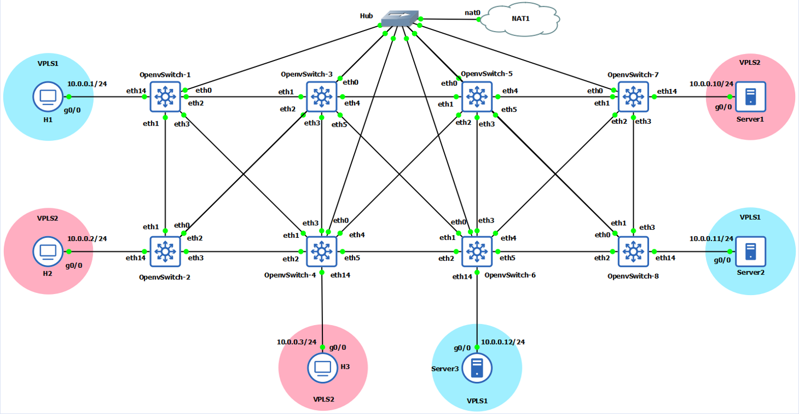
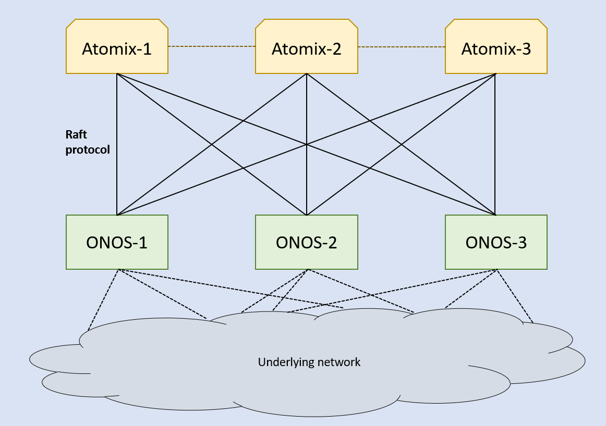
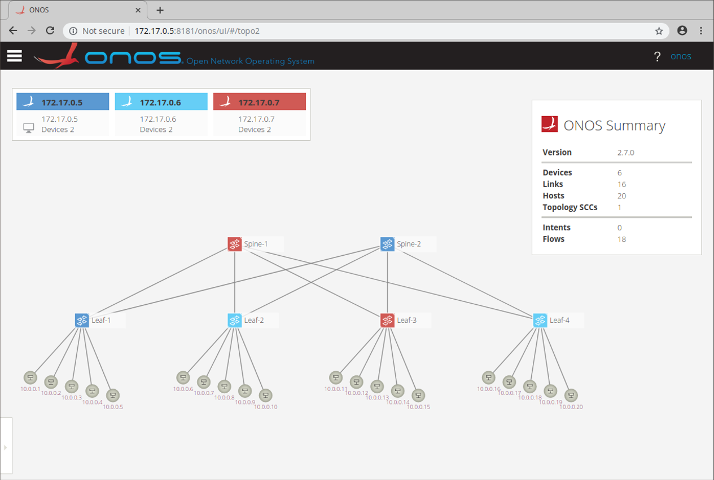
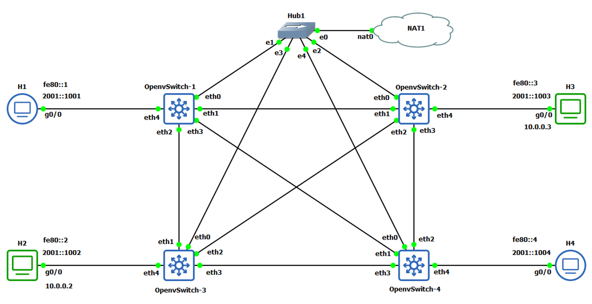
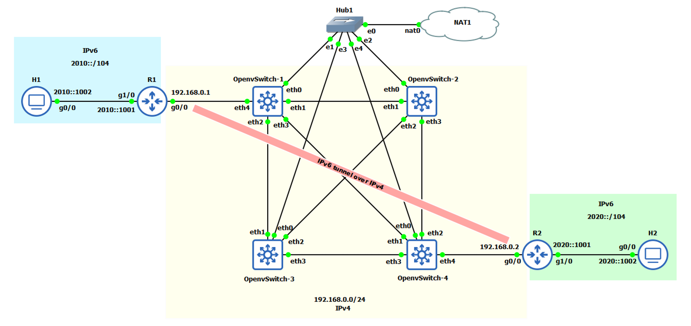
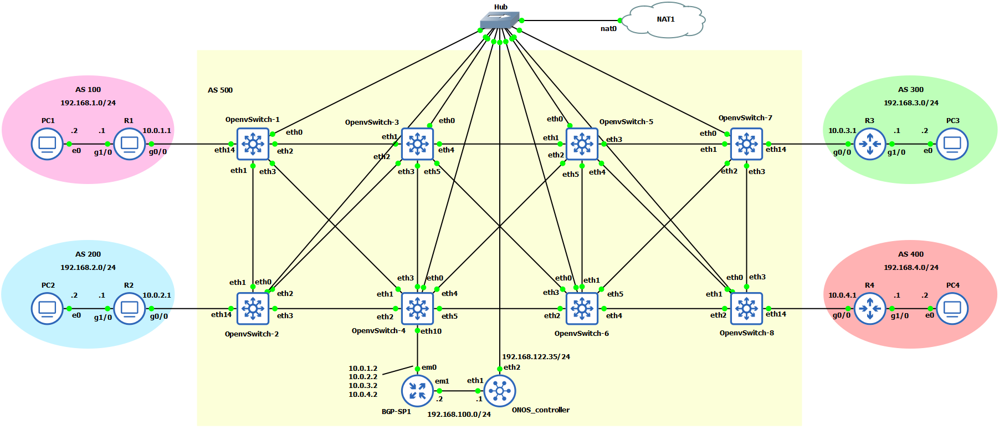

# Software-Defined-Networking-with-ONOS

The aim of this thesis was to study the functionalities of software-defined networks and practically develop the real-world resembling environment in the network emulator environment to evaluate the performance of differ-ent SDN components.

With the advancement of software-defined networks, several network components were developed by different communities. The main component of the SDN architecture, SDN controller gained several production competi-tors for its development. Even though these controllers support the similar network services and try to overcome the same difficulties, many differences are observed in the development and functionality of the component. Few of the open-source SDN controllers well-known amongst researchers, developers, and commercial users gained more popularity because of being readily available, and flexible when it comes to self-developed chang-es and upgrades. These controllers gained more popularity also from the other communities for the software upgradation and modification from their base versions. Various SDN controllers were developed based on the framework designed by different controllers. These evolved versions of controllers were found to be rich in fea-tures and functionality along with solving the problems faced by the base controller. Other components of SDN such as software switches and their supported protocols also received several opponents for their development. Before implementing all these components of SDN in real-world networks, the detailed performance analysis of each component is crucial. To evaluate the functionality of SDN, various testbeds are available with promising real-world network resemblance in emulation environment. All these different aspects of SDN were researched over the course of this thesis.

********************************
Use Case-1: Testing the ONOS Controller with Isolated Layer 2 Overlay Networks

********************************
Use Case-2: Testing the Network with Multiple ONOS Controllers

********************************
Use Case-3: Testing the ONOS Controller with IPv6 Addressing

********************************
Use Case-4: Integrating Software-defined Network with the Legacy Networks

